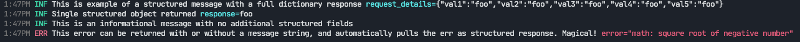

## Logging

At this stage, I'm using [zerolog](https://github.com/rs/zerolog) as I found it very easy to get moving with structured logs.

The output of this demo looks pretty good!

Here's a functional demo that can be used to bootstrap a new project with this.

