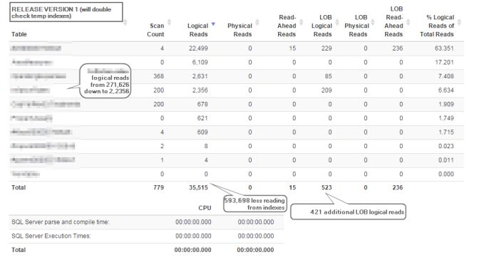

> [!info] Updated: 2017-04-21+
> Another great bit of news from reviewing this older post I wrote... SQL Sentry Pro is now a free tool thanks to the generosity of the Sentry One team! It's a must have. Go download it for sure.

> [!info] Updated: 2015-04-28+
> I created a few autohotkey scripts and solved the problem of collapsing panes and a few other annoyances. This has improved my experience a little. - Also noted one major improvement that would help with tuning is aggregating the total IO, and stats, rather than only each individual statement. I've found the need to compare two very different plans to see the total writes/reads variation and the impact on IO, but I've having to utilize another tool for statistics IO parsing to run totals, and then come back to the SQL Sentry Plan explorer for other details. The SQL Sentry plan explorer tool could be improved by enhancing with totals/sums to better compare various runs of plans. I can make do without it, but it makes me have to do a lot of workarounds for now.

I'll post more later, but after a full day of query tuning on a difficult view, I'd definitely say the cost for PRO is worth it. I'm a fan of sql sentry (free), and decided recently to push for a license at work on this tool. Turns out it was well worth it. The ability to measure variance in plans with small changes without cluttering up SSMS without 20 versions was incredibly helpful and time saving. There are a few quirks that really bother me, but not enough to negate the benefits of this tool. Perks - Save a continual session on troubleshooting a query - Evaluate Logical IO easily in the same view - Save comments on each plan version run to identify the changes you made and what impact it had Negatives - Not integrated with SSMS or preferred text editor so the text editor extremely sparse on features. - No ability to easily sum logical IO and COMPARE to another plan, really you have to open two tabs and eyeball them. That is the biggest frustration, no easy comparison side by side without opening the same session and eyeballing. - NO KEYBOARD SHORTCUTS. GEEZ is that frustrating as you are trying to power through some changes, copy cells/io, and more. Overall: Love the product. Hope they enhance the producivity and efficient aspect more as that's the only area I'm seeing it's short in. Here are some screenshots from my work with it today. I additionally compared the final IO with [http://statisticsparser.com/index.html](http://statisticsparser.com/index.html)

