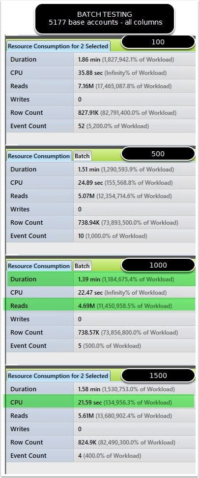
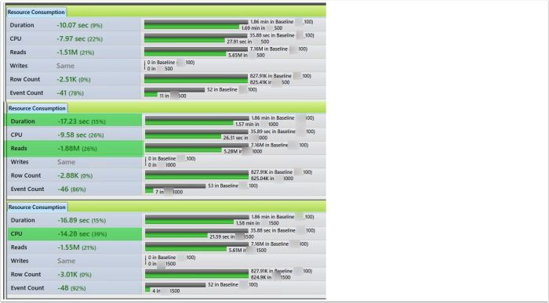
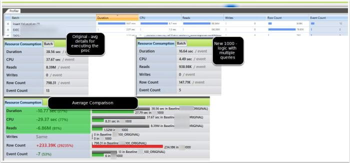

# Qure Analyzer Benchmark Testing

> [!warning] Updated 2018-03-18+
> Wouldn't recommend tool at this time. Development seemed to cease, resulting in me not being able to use with later versions of SQL Server. When I came back recently to check on it, the app was sold and it was with a new company. Didn't see to have progressed much based on a quick look and not really interested in it at this point. Instead, other solutions like the new DEA (Database Experimentation Assistant from Microsoft) would be where I'd spend more effort.

## the problem of monster views

I've been working with tuning an application that performs a lot of Entity framework calls, as well as stored procedure activity. The stored procedures could be processing a large amount of data, or a small amount, depending on the configuration of the client. The major issue was the source of the data for the client application was a view with 20+ joins involved. In breaking down the logic, most of the joins really functioned as just adding additional columns of data. The logical grouping mean that mostly 2-3 tables at a time joined to provide a set of columns based almost exclusively on the source table.
I needed to get away from this pattern, as I was finding tremendous issues with cardinality estimation for SQL Server, resulting in sometimes 20GB nested loop join worktables by the optimizer.

## Simplify

### the incredible masterful... well... actually quiet simple solution... simplify!

My proposed solution was to break up the large view into small pieces, which I identified by logically grouping the joins/related columns. Instead of 20+ joins to return the columns needed, I'd instead provide 10 separate selects of 2 tables or so in each query. These would be processed as a dataset on the client, instead of returning a single large datatable.
The next issue was to identify the improvements based on evaluating the possibility of larger amounts of base accounts pulled at once with the new format, vs the smaller batch size the large view required to function at all.

### first approach was statistics io & Sql stress

Using the SQL Stress tool along with evaluating the statistics io, time was the my first course of action. However, the problem I ran across was really that I needed to run this dozens of times in a row, and evaluate the impact on the client performance as well. SQL stress provided a great way to run the query manually, but with the input variables from the app, I really wanted to run the app as the end user experience, and request the batch job on the largest amount of rows I could get. This way, I truly was matching all the input from the app, and getting timings from this.
In addition, I was looking for a good way to evaluate the workloads against each other.

### the right tool for the analysis = Qure Profiler

I'd used ClearTrace before, and found it helpful, but hard to consume some comparison type reports easily. I needed something to help me identify the improvement or degradation of performance and Qure Analyzer solved this for me, turning something very messy into a much simpler proposition (which also helped with my end research presentation to the big kahonas).
Dbsophic Qure Profiler has had some great reviews for assisting in database profiling, but I haven't had a chance until recently to fully dive into using it. Since I was doing batch testing, I figured now would be a great time to re-review it. The numerous variables at play made this pretty complex to really quantify any improvement based on a single run alone.  So, I brought back up Qure Profiler to help me out.
_Necessity is the mother of experimentation._

## Initial Performance Evaluation Run (Batch level analysis)

Evaluated runs on the largest current grouping. This was 1232 base accounts. I would later evaluate with larger batch sizes, but started simple.

### Actual Execution Details with Qure Profiler

Tested Again With QURE Profiler set to minimum batch info. I also ran DBCC free proc  cache to attempt to better ensure the plan was correctly rebuilt for the new counts, and that it was a fresh start in the comparison as far as impact on the disk IO.

### Comparing 100 to larger batch sizes in the base account request

This final comparison shows 42% improvement by using 500 rows at a time. This seemed to be a good compromise at this point to increase batch sizes, while still maintaining lower logical reads. Next step was to test against a larger database to evaluate scalability.

### Actual Execution Results on Larger database

Evaluating against a database with about 500GB of data, I found the best execution time seemed to be the base account count (tongue twister) seems to be the 1000 batch size at this time. It is returning the results in the shortest duration and the lowest impact on reads. FREE PROC CACHE COMPLETED ON EACH STEP

### Qure Profiler workload comparison

Set the baseline as the 100 batch size (which is the current way of processing the request). Qure provided an extremely powerful side by side comparison of both of the workloads. The best value is still the 1000 batch size, showing that the logical reads at point.

### Comparing to the original methodology of a huge view with 20+ joins

Against two databases, both performed signficantly better with the simplified approach. One database was much faster, while another that was completely timing out with 20GB+ nested loop join worktables finally ran without incident. Major win!
The changes look to have positively improved the performance overall for both databases representing two much different usage patterns (and data stored in it)
_*When comparing new (1000) simplified procs vs 100 on original views it showed: *_
- **27% shorter per execution**
- **77% less cpu impact**
- **81% less logical read impact**

### Additional functionality I haven't even touched on

Qure Profiler offers additional functionality that I haven't even gotten a chance to touch on. It can normalize the count of events to compare an even 100 against another 100 even when the second trace might have run longer and caught the event more than the 100 times. Check out [their page](https://www.dbsophic.com/) for more details.

## TL;DR Summary

Long post. If you read this far, I commend you for either being a great page scroller, or for being tenacious and finding all my graph's super interesting. If that's you, you get #SqlCred
I'm finding that with workload testing, Sql server workload comparison is one of the harder things to do right. There are a lot of variables to take into consideration, and even when doing a simple test on batch size changes like I did, aggregating the comparison results into usable statistics and in a presentable format can be daunting.
Highly recommend the dbsophic product for a great utility to help save a lot of time in doing this comparison.  This tool goes into my top SQL server performance tuning tools for sure. I'm going to be evaluating their more advanced Qure Optimizer soon as well, as it might help identify other issues I've missed on tuning by evaluating adjustments against a test copy of a database.

## Are there any cons?

I didn't run into any significant issues that impacted my ability to use it. I do think there were a few stability issues that I had to work around by restarting the app a few times, but for the time it saved, I wasn't complaining too much.
1. Need to offer option to use extended events. This is on their roadmap apparently. Xevents should help lower the impact from doing the profiling on the workload being tested.
2. Some app errors related to closing workload comparison tabs. I reported this bug and hopefully they'll continue to improve the application.
3. Maybe some GUI improvements to make it more in-line with modern UI standards? Just a personal preference. I didn't find the tab based comparison approach the most intuitive. Not terrible, but would be a nice improvement in the future.

## What could they improve?

1.  Offer comparison report option that wouldn't require as many screenshots, and instead summarize the selected items in a pane that you could copy to image. This would be slick!
