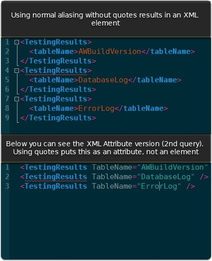

## XML handling with aliases

I find it interesting the difference in behavior with querying XML between column assignment, and quoted alias naming.
It's a generally understood best practice to not use the deprecated syntax of column aliasing using a quoted name. For example:

```
select
    [escapedWithBracketsIsGood] = case when raining then cats else dogs end
    ,NoEscapeNeededPerGoodNamingPractices = case when rains then pours else friday end
    ,case when writtenThisWay then ICringe else UseAssignmentWay end as NormalWayMostFolksDoIt
    ,'BadNaming' = case when food then eat else hungry end
    ,case when work then eat else JobLess end as 'VeryBadNaming'
```
You can see the difference in naming. The bottom too are deprecated syntax from older naming standards, and should be avoided typically. Aliasing is pretty straight forward and the variance in doing your alias pattern doesn't normally have an actual impact on the results or way of handling...
**Except when doing with XML apparently**

[Gist](https://gist.github.com/sheldonhull/aae7d80467d37b89dc15)




## Further reading

MSDN covers in more detail and precision in the [this page](https://msdn.microsoft.com/en-us/library/bb510462.aspx)
The handling of XML is a newer area to me, as previously I've avoided like the plague. However, in working w/apps sometimes creating XML configuration files might be useful so exploring this can helpful to understand how to manipulate and even obtain values from it.
