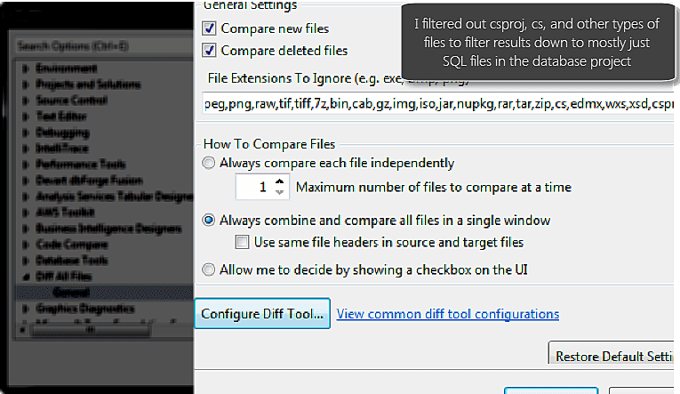
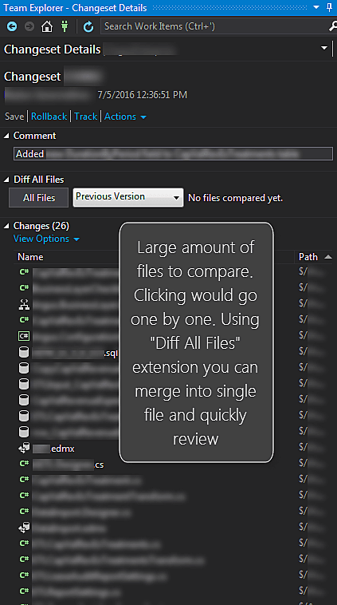
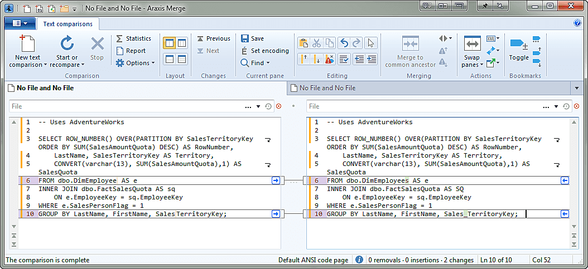
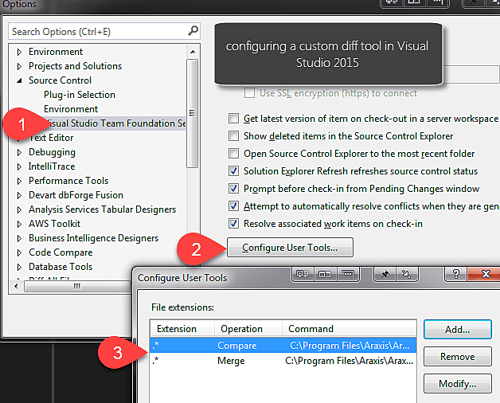

# Diff all files

> [!info] Updated: 2017-07-14+
> Still find this incredibly awesome! Developer just updated for Visual Studio 2017 after a lot of hard work. Github repo here for any issues. Big thanks to DeadlyDog for this great tool and putting in the effort to update for VS2017. [deadlydog/VS.DiffAllFiles: Visual Studio Extension to make comparing files before and after committing them to Git and TFS faster and easier](https://github.com/deadlydog/VS.DiffAllFiles)

> [!info] Updated: 2016-01-25+
> I started using the option to compare a single file at a time, since it picks up the syntax highlighting then. The other way (merge files into one) can't handle syntax highlighting with the various files types all mixed into the same window. Diff All Files extension handles this beautifully with proceeding one by one and automatically opening the next file to compare or allowing you to hit next to close and reopen with the next file to compare. I still enjoy using this due to the "context" lines that reduce the noise to just the actual section being changed.

If you need to do code comparison on a lot of files in Visual Studio, I ran across an extension [Diff All Files](http://bit.ly/29nXEbe) that is really helpful for merging down the individual file changes into more consumable format.

In the changeset view you can select diff all files and whatever settings you've setup in the Tools > Options > Diff all Files settings will then feed through automatically.

You then click on diff all files in the changeset viewer

All the non-excluded items will then be merged into a single file, if this option was selected, or separate windows. Personally, I've found the merged view really helpful to have one single pane to scroll through.

## Third Party Comparison Perks

To go a step beyond this you could use a third party comparison tool. My preferred option is Araxis Merge (disclaimer: they provided me with a license for evaluation, which doesn't impact my assessment). I really like the fact it merges down similarities into a concise comparison. This tool gives you the option to provide only the different lines, with a X number of lines before and ahead for context. This could reduce thousands of lines of code to just a few hundred that have variances. Win! Highly recommend you check them out, as if you are doing open source they have a free license for that. If you do a lot of code comparisons, some of the additional functionality in their app might be worth it, otherwise the built in viewer in TFS is pretty good.

In my test comparison, I reduced 3245 lines of code in the comparison window to 25 lines, which was the actual changes + 10 lines above/below for each change to have context. This resulted in only a few hundred lines to scroll through. Made my life easier!
The only con for me with Araxis is no dark theme.... but I'll live.

## configuring third party tools

I saved this snippet from working through Araxis documentation for setting up their tool with Visual Studio.

[Gist](https://gist.github.com/sheldonhull/8f46d34d2c3c83a4c18e5d70e92e5d3d)

I also just ran across another site that had a nice resource list of configuration settings for different comparison tools.  [Diff All Tools - Visual Studio Extension](http://bit.ly/29nX1yF)

## Other comparison tools

Third party tools can be great for some extra perks like File versioning, comparing folders, and more. You can get by without them, of course, but if you do a lot of change review consider some of the options. A few others I've reviewed (if pro/paid they provided license for me to evaluate)

- [Delta Walker (pro)](http://bit.ly/29nXlgM): Great UI, does image similarities comparison tool. Didn't seem to have a "show only changed lines with context" like Araxis at the time I reviewed. Mac app!
- [Devart Code Compare (pro/free)](http://bit.ly/29nXQaq): I love most programs Devart puts out. This is a good comparison app. Wasn't my preferred option, and at times struggled with large files, but overall was good in comparison accuracy.
- [DiffMerge](https://sourcegear.com/diffmerge/): Brief overview, solid tool, just didn't have specific improvements I needed (focused on changeset/sql comparison)
- [Beyond Compare](http://bit.ly/29nXj8G): didn't dive into this extensively. They have a devoted following with a lot of loyalty, so check them out if you want to evaluate their software.
- Built in TFS diff - great for a built in tool, I just wanted to have some enhancements in what to ignore and summarize.
- [SQL Compare](http://documentation.red-gate.com/display/SC11/Setting+data+sources#Settingdatasources-Selectingaversionfromsourcecontrol): my favorite for reviewing changsets that are directly in TFS. I wish they'd add a module for just pulling up the diff view without having to open SQL Compare to setup a comparison though. Sounds like a good user voice feedback item :-)
