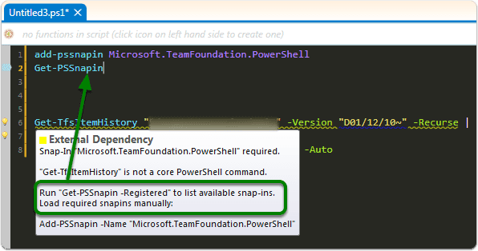
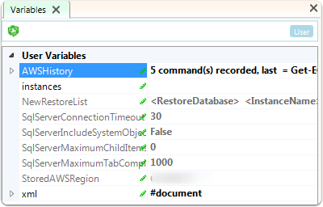
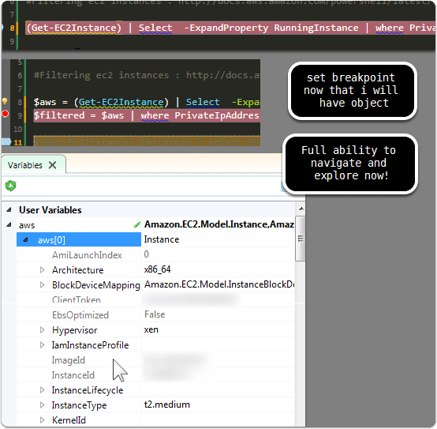
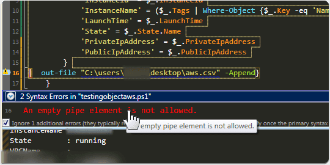
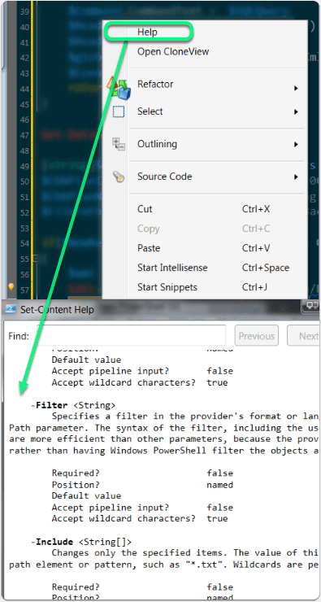
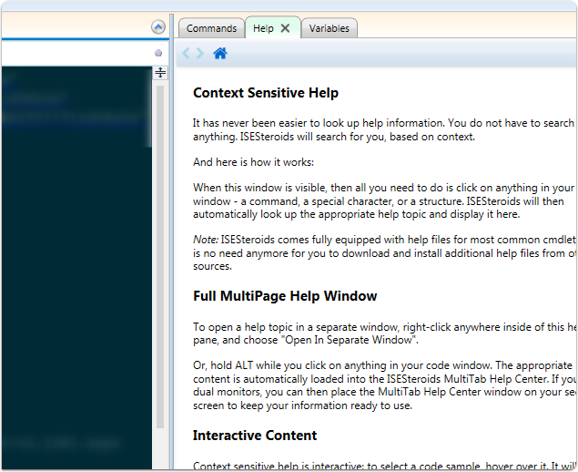
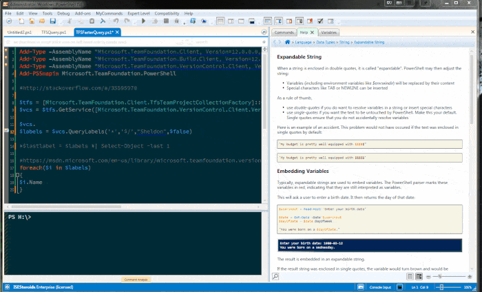
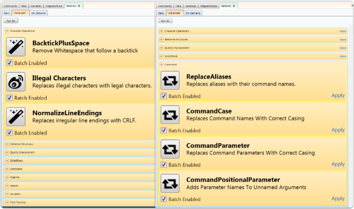
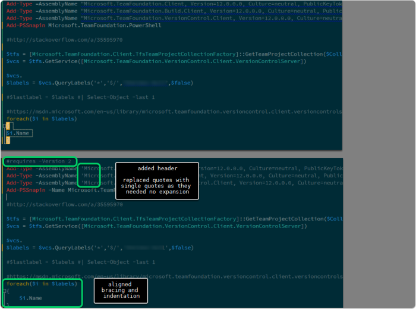
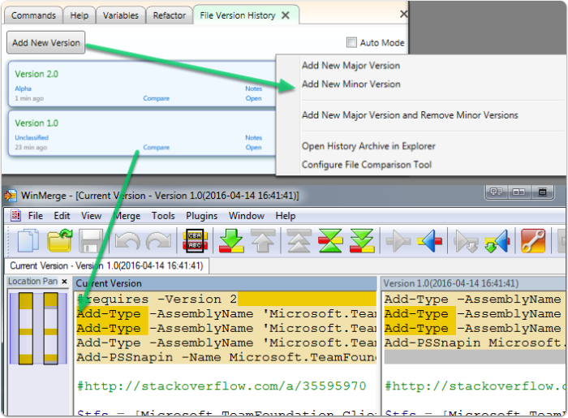

Disclaimer: I have been provided with a free license because I am reviewing. This doesn't impact my assessment of the tool. I have a passion for finding tools that help developers, and even more specifically SQL DBA/Developers improve their workflow and development. I don't recommend tools without actually using them and seeing if I'd end up adding to my roster of essentials!

[Cool Tool: ISE Steroids](http://www.powertheshell.com/isesteroids)

## Expanding Powershell ISE

Powershell ISE is simple. Not much fluff, but it gets the job done. You already know you have it on most of your machines, so expanding ISE seems like a logical step if buying something like Sapien's powershell studio or installing Idera's/Dells/etc studios are not something you want to do. I ran across Powershell ISE-Steroids as a recommended "must have" and decided to investigate further.

## Intelligent Code Parsing

For those of us that don't live daily in powershell, having some explanations on best practice and some guidance is a welcome change.

## Variable Explorer

This is a great implementation of a variable explorer that can dramatically help when debugging scripts.

## Diving into variable explorer

I was having trouble finding the right property and objects with Amazon Powershell SDK for AWS. So I broke up a query to get instances into several steps and then explorered the objects. This made things much easier to explore.

## Intelligent Error Checking

Helpful description on error when I clicked on the warning icon

## Help

I need powershell help a lot. I don't work enough it in it to have it all memorized, so having a helpful syntax reference guide is a great plus.
I'm a big fan of more help...that is easily accessible. I'll take as much "powershell for dummies" guidance as possible. I know you can find help with built in powershell functionality, but again, it's the combination of all the little shortcuts and pieces together that help so much.
Small benefit is context menu selection of help. With regular ISE, you can run `UPDATE-HELP`  and then press f1 over a cmdlet to get details, this is just a shortcut on the context menu. However, it's a helpful reminder for those newer to working with Powershell ISE.

## More help

Help as you've seen it is triggered on executing help against specific cmdlets. However, ISE-Steroids has a context sensitive help that's pretty cool.

## example of contextual help

## Refactoring Utility

Lots of great best practice refactoring can be automatically applied.

## refactoring

This is a very small example of what it would do. A better case would be a more complex powershell query.

## Versioning of powershell scripts

Instead of having to constantly comment and uncomment for fear of losing work, you can keep things nice and clean with the versioning built in. This is great, I wish more editors had it.
In this case there is a shortcut to pull up a compare and you can open up the code comparison quickly to see what variations in the script have occurred. Additionally, commenting is possible.

## thoughts

If you are working with powershell then something like ISE Steroids can provide some smart help, ensuring better script quality, and hopefully saving some time. It's a recommended tool for my #cooltools list.
