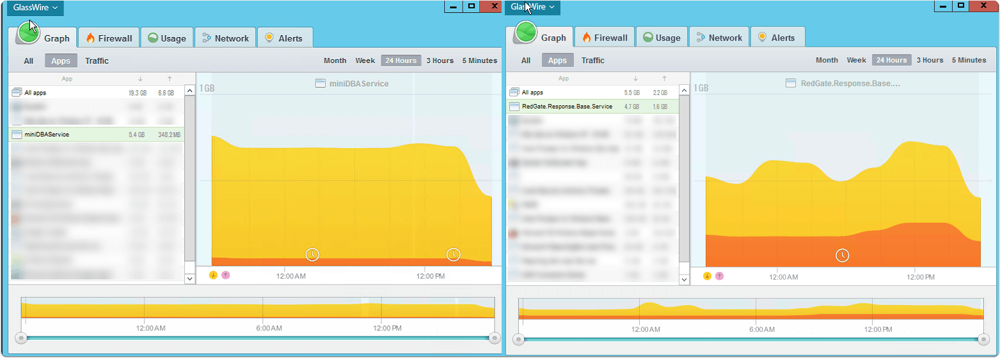
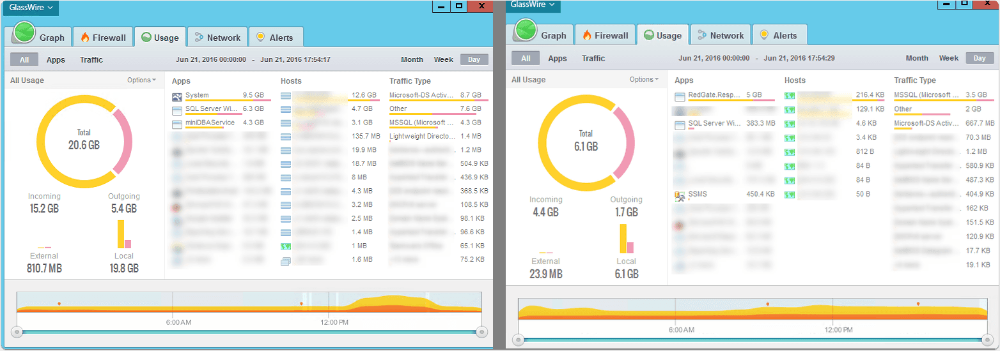
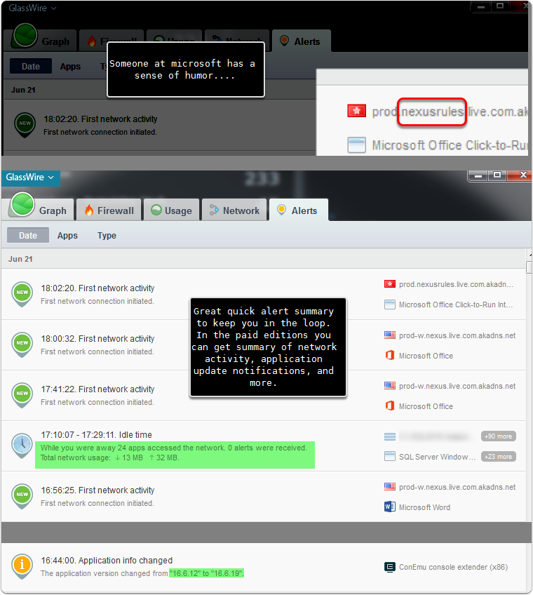
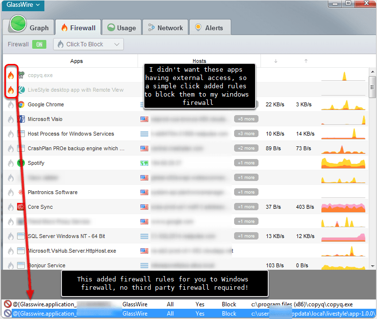

**Giveaway details at the bottom for those interested**Dealing with development & sql servers, I like to know what type of network traffic is happening on my machine. What is the overhead of monitoring on network bandwidth, what is communicating across servers or even externally?

## What is phoning home?

You can create perfmon counters, but realistically sometimes I just want a easy quick overview of network traffic with minimal overhead. I have been using a utility I came across called Glasswire, and found this tremendously helpful. I'd highly recommend taking a look at this. I've installed on a couple of the sandbox sql servers I have worked with and found it really great for evaluating the network traffic occurring from the monitoring services running on them.
_Disclaimer: I have been provided with a free license to allow me to review the product in detail. This doesn't impact my assessment of the tool. I just love great tools and try to help other developers find them._

## Network traffic monitoring

Sounds boring, but Glasswire changed my perspective on this. I always want to know what's "phoning home" and using up my bandwidth, but until I tried this app, I never have found something that tracked and reported on it in a clean user friendly way. Process Hacker is my preferred task manager, and it can provide some metrics when running, but not a long term history, and not in a user friendly format for analysis.

## Comparing timeline

I found this great as a simple way to compare two SQL server monitor tools traffic against each other. I wanted to know the network traffic load they were generating, and this was a great way to get some quick transparency on the network impact. In this example, the test wasn't perfect as they had slightly different detail level tracking configuration, so just take this as an example.

## Comparing Usage Metrics

## See activity

I really like the transparency of seeing what network activity is occurring on my system. I've found myself evaluating why apps would need to connect rather than just allowing everything through.

## Easiest firewall tweaking I've seen

## Would I recommend

Completely! I've found this to give me a transparency into the network ativity in a great way.
PROS

*   Beautifully thought out design
*   Creates a great awareness of network activity, allowing you to be more proactive on what you allow to send data out
CONS
*   Some "power user" functionality would be nice, such as being able to customize or get details from the desktop widget, add special alerting on specific apps whenever they request network access, etc. These are small things though. I think the overall design is very elegant and well thought out
*   Price. For normal users this is really expensive for the pro version. However, if you are just interested in some basic monitoring without a long history and desktop toast alerts, you can get the free version and still get great value from it.

## Interview with Developer

I thought the app was unique enough in design and function that it would be great to get a short interview with the owner to share a bit about his development approach, goals, and overall story.

### Tell me a little bit about yourself and your company.
Before GlassWire we made a webcam virtual driver software that allowed you to use your webcam with multiple applications simultaneously.  That company was acquired a couple years ago.  Making a sophisticated driver gave us experience with making drivers, so we used that experience to make our network monitoring driver.
Since launch we have been surprised by how many people use GlassWire to keep their data usage low and save money and resources.  For example some of our customers have boats and they are on very strict data plans out on the ocean, so they use GlassWire to see what's wasting their data and also block apps they don't want to use while out at sea.
After we launched we were surprised by how feedback was so positive right away.  I was worried that nobody would want the software at all, but people seem to like it and we have now had close to 4 million downloads.

### What made you want to build a network application like Glasswire?
I always felt that I couldn't see what was happening with my PC's network usage so I built GlassWire for myself so I could instantly see what was happening.  I also had some relatives who lived in a remote area and could only use Satellite Internet access.  Satellite only gives you a little data, then throttles you so it's very useful to see what apps are wasting your data. GlassWire also has a built in bandwidth overage monitor to help with that.

### Why was QT chosen as your graphs/design?
I tested a lot of different tools to see what was happening on the network but I found them difficult to use, plus I couldn't find any that could go back in time and show me past network usage so our team worked together to build GlassWire. QT allows us to build a beautiful UI and make changes easier over time.

### What's been some of your hardest decisions in designing the application?
After launching we found that Bittorrent users were causing GlassWire to use too much memory/resources on their PC because Bittorrent communicates with so many hosts simultaneously in such a short time period.  We had to redesign GlassWire to use less resources for these users, and I blogged about it here [https://blog.glasswire.com/2016/03/29/how-glasswire-1-2-saves-your-memory-and-resources/.](https://blog.glasswire.com/2016/03/29/how-glasswire-1-2-saves-your-memory-and-resources/.)  There were a lot of different hard decisions we had to make, like adding "loading..." in some places in the UI to take the load off of GlassWire for users who had too many hosts.  I was worried users may find these short delays annoying bit fortunately nobody seemed to be upset about it and we are continuing to grow, and GlassWire now uses significantly less resources for everyone.

### Do you have a design philosophy that helps balance more features with simplicity?
I try to look at other popular applications and study what makes them successful.  Currently we are working on our Android application and the work on Android has helped me come up with some ideas on how to improve yet simplify our GlassWire desktop software.

### What's your thoughts on implementing user feedback vs bringing design choices that no one even thought about?
We love to get user feedback in the forum and on Twitter, etc...  For me it's easy to come up with feature/design choices because I want GlassWire for myself.  I think I'm a pretty normal person and usually the things that I want others want too.

### Any future projects you want to accomplish (not a roadmap, but general things you'd love to tackle)
We're excited about bringing GlassWire to mobile and Mac, but it's not easy so we're trying to make sure our Mac/mobile versions have the same high quality as our desktop software.  We don't want to cut corners, so I hope our fans will be patient!

### Can you tell me a few of your design philosophy decisions that drove some of those simple UI differences that are a bit uncommon? (like the graph refreshing smoothly without 1 second gaps)
Since we built the software for ourselves we tried to create a simple layout that we preferred, kind of like a web browser.  We tried some 1 second intervals but it made the graph look jerky and it hurt the eyes so the team spent a lot of time making the smooth graph we ended up with. One of the main things I wanted myself was to be able to see what caused a spike on the graph and with GlassWire you can just click the spike, then see what hosts/apps were involved in the spike.

## Giveaway Details

Glasswire was kind enough to provide me with a license for their Elite version (currently $199) which is a onetime fee. You can get the hookup!
To get the hookup on this... I'm making it technical since this is not for sweepstake surfers but my techy SQL friends....
**Reminder: This is a Windows application, not Mac.**
Drawing will occur end of July and winner name will be posted here and notified in Twitter direct message

### Giveaway Result 2016-08-11

Congrats to Tim! I'll be sending you the license details.
Hope you enjoy and thanks to Glasswire for sponsoring this. Give the free version a shot, even if you aren't planning on going pro. It's a great tool for anyone to increase transparency on what's really happening with their system.
