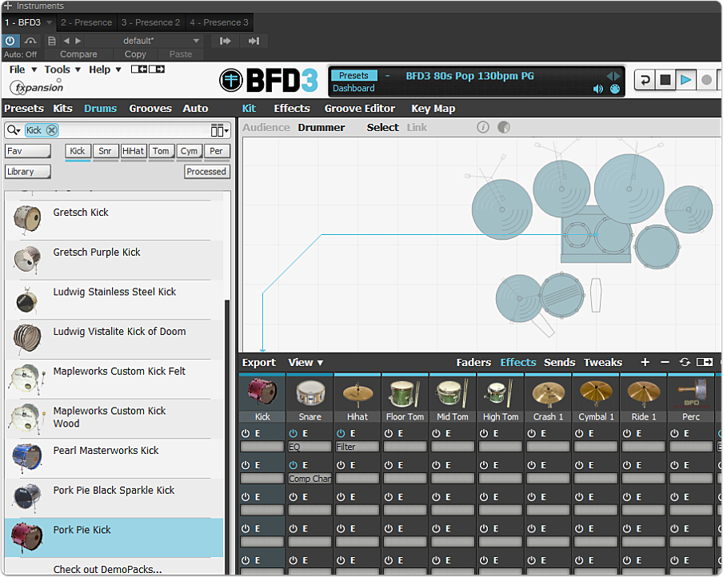
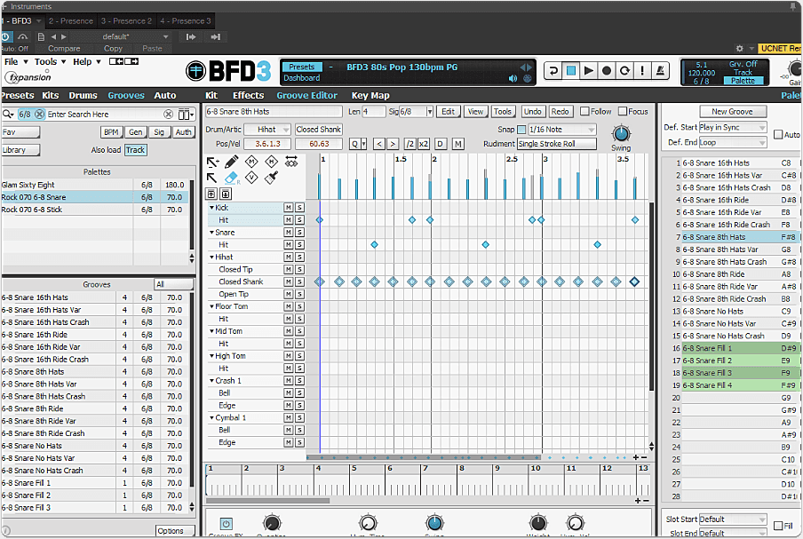
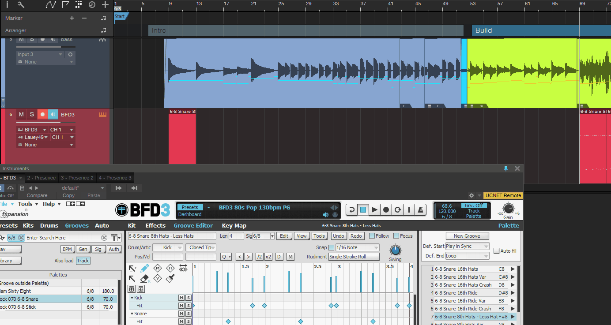
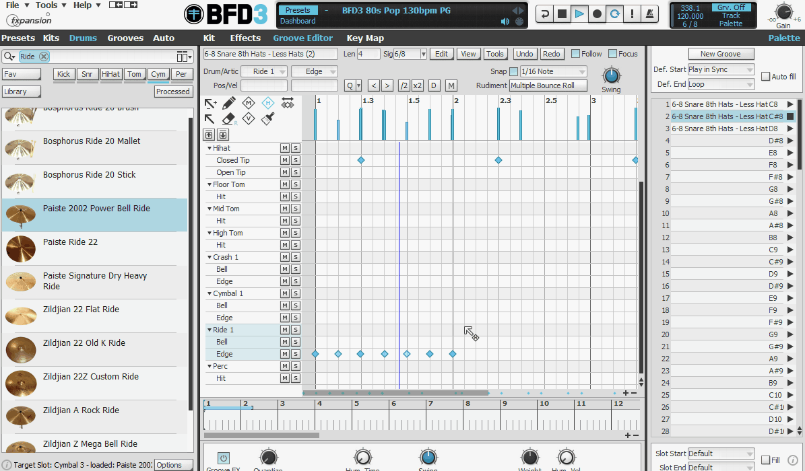
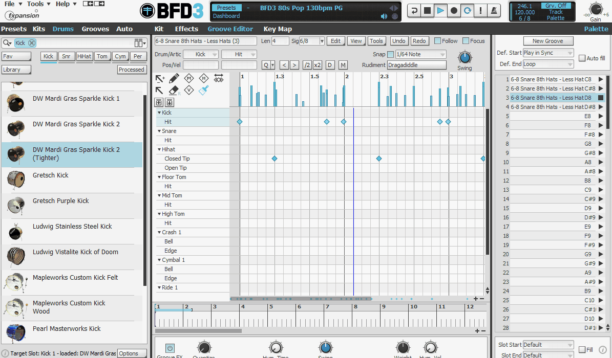

Creating tracks at home can be very intensive in time, so I'm always looking for a better way to bring a larger sound to a track with less effort. One of the big gaps for me has been the drum parts. I've evaluated a few options, and finally dived into [BFD3 ](http://bit.ly/2dHCt87)for this latest project that is a post-rock style track. This was my first time diving into BFD3 for a full song, so I had a bit to learn.
_Disclaimer: BFD3 generously provided me with a copy to evaluate. This doesn't affect my reviews, as I just love dig in and recommend good software!_

## BFD3 - Drumming Plugin Extraordinaire

I was using this in Presonus Studio One. I created a drum track and then started to explore. I started my exploration based on using the Groove Editor, as I wanted to benefit from the library of preset grooves that were already created, and use these with some modifications to be the drum parts for me song, allowing me to hopefully create the track I wanted quickly.  There is a lot of functionality I'm not going to dive into, such as the vast array of microphone adjustments, compression options, and other mixing options. My focus is going to be as a songwriter, how could I use this to help me generate a believable drum track for my song without it being an ordeal.

## Modifying Existing Kit

One thing that was really easy to do with BFD3 was modify the kit configuration. I liked the sound of Pork Pie Kick for this song, so I just played a groove, and then switched it over with the checkbox (on hover).

#Grooves
The Grooves section provides a preset set of associated rhythms to allow you to easily prepare a song based on related rhythms. This is ideal for helping you create a song quickly by finding associated rhythms.

###Copy and Replicate a Groove to Tweak

### Change Velocity for Realism

This is really important to a natural sounding drum part. You definitely do not want everything at the same velocity as no real drummer would do this. There are some easy ways to adjust the velocity as well as the humanization of the rhythm in both Presonus Studio One 3 and BFD3 plugin. In this example, I adjust it in BFD3 directly.

### Humanization of Rhythm

### Practice Your Rudiments

One other cool feature for quickly pumping out some grooves is the ability to "paint" the rudiment you've selected. This means you could easily pick some drag paradiddles on the snare without having to click each point in time. I found this incredible helpful for creating some interesting grooves.

# Quick Note on Versions

I tried the BFD3 Eco, but due to wanting flexibility to edit the grooves and do more tweaks, the Eco version was not a good fit for for me. If, however, you are looking for an experience that is more groove oriented, with less tweaking/adjustments, then you should consider starting with the Lite version. If you are looking for the full flexibility then you might want to evaluate the full one instead.
FXpansion indicates on their support page in the comparison on the differences that:

> What are the differences between BFD Eco and BFD2/BFD3?
> BFD Eco is optimized for ease of use and fast results - it is deep enough for deeply sculpting drum sounds into all manner of shapes but is streamlined enough so that you won't be overwhelmed with options.
> It has less detailed sounds than BFD2 and BFD3 but is much more light on system resources.
> BFD2 and BFD3 contain far more control over each aspect of each kit-piece as well as a configurable mixing engine with custom aux channels and much more. They also feature full editing of Grooves, more control over exports and many other features too numerous to list. [FXpansion Support Article](http://bit.ly/2dHC4Cl)

# Final Thoughts

The power and flexibility of this software is pretty amazing. I've only touched on a small fraction of what it is supposed to be capable of, as I'm using a lot of the simple functionality to "paint" some rhythms.
I was a little disappointed in the initial groove library as far as the single 6/8 groove test goes, as it felt more difficult to get a groove I liked than when I demoed Ez Drummer

However, the flexibility in editing with the easy humanization and editing of the kit made up for this. I think the vast sound library of plugin packs is what is designed to expand this, so I'll probably cover some of those later to evaluate if they fill in the gap on providing a even larger variety of preset grooves for the wannabe composer. Note that the library is around 40GB for the initial load, so my isolated 6/8 groove test isn't reflective of the rest of the available library. There is a lot to work with, and the expansion libraries seem to be pretty vast in number.

Another area that would be awesome to enhance is providing something similar to "song finder" that EzDrummer 2 had, where a certain rhythm was tapped, and related matches found. EzDrummer 2 then provides something similar to Grooves where the song structures for verse, chorus, bridge, etc are laid out. I'm not partial to the format that EzDrummer used, I actually prefer the Groove library format of BFD3, but I sure would love seeing the search capability added to help quickly match grooves fitting the feel you are trying for.
I'm pretty happy with the documentation and support, as they have a wide range of well made videos showing demonstrations on the product, how to use, etc. I look forward to incorporating this into my workflow and going through some more training videos to better understand a solid workflow, as I'm just starting to wrap my head around it, along with learning how to navigate Presonus Studio One

[Check out a trial](http://bit.ly/2dHCt87) if you want to give it a shot and post some feedback below on what you think. Remember, I'm not an affiliate, or getting paid for anything on this, I just like reviewing and referring folks to good software.
Good luck!
