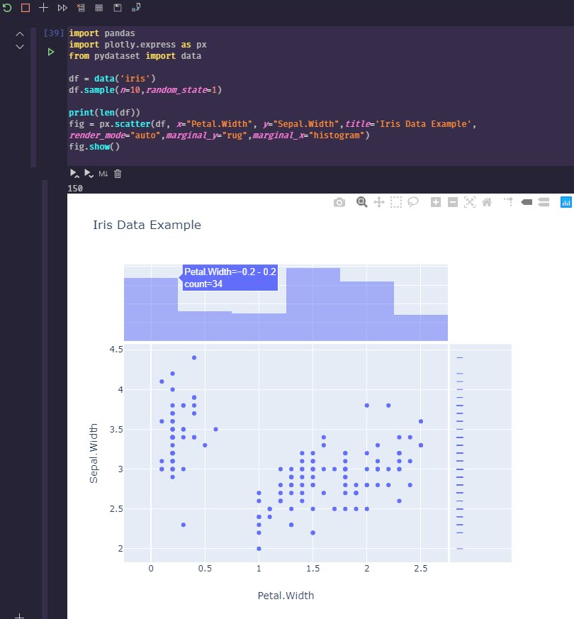

## Intro

To get started with running python queries with SQL Server is actually pretty easy. I waited far too long to tackle this, thinking it was much harder than it turned out to be. Hopefully, this can be a good starting point for you as well.

## Why would I want to do this?

When you use great tools like dbatools with PowerShell, you come to think that PowerShell is a first class citizen for working with SQL Server. This is true in regards to administration and general usage. However, data exploration is a different beast.

## PowerShell & .NET Are Not Designed for Adhoc Data Exploration

First, can they? Yes. But just because there is a library someone created to give you some of these features, are the languages themselves first class data exploration languages, especially for adhoc and exploratory work. I think most would agree: _no_.

To be very clear, I know there are possibilities, such as the newer Azure Data Studio powershell notebook feature, and likely other modules that can help with exploration. What I'm trying to be clear about is that those are all exceptions to the rule, whereas exploration in Python is a first class citizen from the start. (coming from a dedicated PowerShell addict :grin:)

Traditionally, I've used Azure Data Studio or SQL Management Studio and run individually queries in a large sql script to explore and manipulate the data. However, once you start wanting to pivot, aggregate, sum, and do various other experimental actions, T-SQL can be over complicated to do this for that adhoc work. Just because you can do unpivot doesn't mean it's a smarter use of time than using a pivot table in Excel for adhoc work (as much as it pains me to say).

> [!info] Azure Data Studio+
> Azure data studio is making great progress with SQL Server based notebooks, which I highly recommend checking out. It's still in its infancy. So while it's pretty useful for basics, if you want to stick with a scripted approach to explore, python will be superior. Just recently PowerShell based code cells are available too, I believe.

However, even better than playing around with data in an Excel sheet, what if you wanted to stay in your programmatic script and start slicing and dicing the data coming back, molding into "tidy data" for what you want to analyze?

PowerShell and .NET don't have the intuitive and experimental data exploration capabilities that have existed for a long time in the Python libraries. They can easily manipulate, group, mold and visualize the data with minimal effort. This is the forte of Python's libraries, and has much more maturity than doing some homegrown solution work around.

## Jupyter Notebooks

I'm sticking with Visual Studio Code, so install the python extension `ms-python.python` and then create a new notebook directly from the command pallet. Once you open this up you can start writing some markdown notes and then running queries and visualizing the results in one place.

## Python Plotly Library

The standard libraries are pretty good. I wanted something that also created graphs that I'd consider pleasing to the eye. The default `matplotlib` wasn't really what I was looking for, so I used `plotly`. This fantastic library has an express edition that gets you up and running in minutes playing with data, and can even convert your visualizations into a nice web app dashboard with `Dash` (also a plotly product).

## Pandas

In addition to working with `plotly` I leveraged `pandas`. I think from my initial working with it, that this library will be a staple for my adhoc data work for a long time. It basically provides a nice easy way to work with `Dataframes`, which is kinda of like working with a .NET `datatable`, albeit, many extensibility, exporting, and other features built into it. I found it intuitive and pretty easy to work with.

## Installing pyodbc

> [!info] platform+
> This guide is written for someone using a Windows based development environment. The setup requirements for running in Linux/Mac will be different for drivers
>
> For running in AWS Lambda in python runtime, there are more complex issues requiring the driver to be compiled and uploaded to a Lambda layer for use. Windows dev machine doesn't have this requirement and should just work after running ODBC driver install and pyodbc. :tada:

1. [Link for SQL Server ODBC Drivers](https://docs.microsoft.com/en-us/sql/connect/odbc/download-odbc-driver-for-sql-server "SQL Server ODBC Drivers")
2. `pip3 install pyodbc`

## Generate Connection File

If you are constantly changing the SQL Server instance you are connecting to, then you may just want provide variables for your script. In my test case, I wanted to create a default connection file that I could use in several scripts to avoid having to set in each module file.

I found some great examples online and cobbled this together from several.

```python
import configparser
import keyring
import xlsxwriter

service_account = "DomainOfTheTaco\\TacoEater"
sql_login_name = "TACO-HIGH-PRIEST"
sql_instance = "TACO-SERVER-01"

driver_name = ''
driver_names = [x for x in pyodbc.drivers() if x.endswith(' for SQL Server')]
print("The following ODBC drivers were identified on your system")
print(driver_names)

if driver_names:
    driver_name = driver_names[0]
if driver_name:
    config = configparser.ConfigParser()
    config['SQL_SERVER'] = {
                            'DRIVER': driver_name,
                            'SERVER': sql_instance,
                            'DATABASE': "master",
                            'Trusted_Connection': 'yes',
                            "APP": "PythonTamer",
                            "UID": sql_login_name,
                            "PWD": keyring.get_password(service_account,service_account)
    }
    with open('db_connect.ini', 'w') as configfile:
        config.write(configfile)
else:
    print('(No suitable driver found. Cannot connect.)')
```

Since I had 2 versions of ODBC drivers available, this is what came up:

```text
The following ODBC drivers were identified on your system
['ODBC Driver 13 for SQL Server', 'ODBC Driver 17 for SQL Server']
```

This generated a connection file I could use in other py files I wanted. The file generated in my user directory `$ENV:USERPROFILE`.

```text
[SQL_SERVER]
driver = ODBC Driver 17 for SQL Server
server = TACO-SERVER-01
database = master
trusted_connection = yes
app = PythonTamer
uid = TACO-HIGH-PRIEST
pwd = redactedtacos
```

This could then be used in python files like below

```python
import configparser
import pyodbc
import pandas

config = configparser.ConfigParser()
config.read('db_connect.ini')
constr = 'DRIVER={{{drv}}};SERVER={srv};DATABASE={db};Trusted_Connection={tc};APP={app};UID={uid};PWD={pwd}'\
              .format(drv=config['SQL_SERVER']['DRIVER'],
                      srv=config['SQL_SERVER']['SERVER'],
                      db=config['SQL_SERVER']['DATABASE'],
                      tc=config['SQL_SERVER']['Trusted_Connection'],
                      app=config['SQL_SERVER']['APP'],
                      uid=config['SQL_SERVER']['UID'],
                      pwd=config['SQL_SERVER']['PWD']
                      )

cnxn = pyodbc.connect(constr)
```

This connection object then would allow running queries similar to executing `ADO.NET` queries.

```python
out_xlsx = "C://temp//python-sql-export.xlsx"
cnxn = pyodbc.connect(constr)
result = pd.read_sql("""
select
    name
from
    sys.databases
""",cnxn)
print(result)

print(f"Exporting to {out_xlsx}")
data_frame = pd.DataFrame(result)
data_frame.to_excel(out_xlsx, index = None, header=True)
print("finished query")
```

To sample in your notebook a few random entries, try this

```python
data_frame.sample(n=20,random_state=1)
```

You should have an excel workbook exported after this. This was even more succinct than using `ImportExcel` PowerShell module which is my normal go to.

## Group Results Into Ranges

```python
import plotly.express as px

# How many results are being returned?
print(len(data_frame.value))

# These are the buckets I want to return results in
# Ie, how many of my results fit into the 0-250 range, and how many 500. These are not fixed ranges.
# Histograms do this type of work as well, I'm showing the grouping overriden at specific ranges with a dataframe in Pandas.

ranges = [0,250,500,1000,2000,3000,4000,5000,6000,7000,10000]
groupby = data_frame.groupby(pd.cut(data_frame.value, ranges)).count()
print(groupby)

# Plotly express visualization
fig = px.histogram(data_frame, x="time", y="value",title='MyFancyTitle')
fig.show()
```

```text
               time  metric  value
value
(0, 250]       1652    1652   1652
(250, 500]       22      22     22
(500, 1000]      10      10     10
(1000, 2000]      9       9      9
(2000, 3000]      2       2      2
(3000, 4000]      1       1      1
(4000, 5000]      5       5      5
(5000, 6000]      9       9      9
(6000, 7000]      2       2      2
(7000, 10000]     1       1      1
```

This is pretty cool, as while you can do this with windowing functions in SQL Server, for adhoc work, I was able to do this in 2 lines. This could save a lot of time and debugging over more complex T-SQL procs.

## Scatterchart

Never having really used scattercharts, I'm seeing in data exploration they can be a tremendously valuable tool.

```python
print(len(data_frame.value))
fig = px.scatter(data_frame, x="metric", y="value",title='MyFancyTitle',size="value",render_mode="auto",marginal_y="rug",marginal_x="histogram")
fig.show()
```

## Quick Example

```powershell
pip3 install pydataset #optional for more than iris data
```

```python
from pydataset import data
titanic = data('titanic')
print(titanic.sample(n=20,random_state=1))
```

This results in output like the image below


To generate a more advanced visualization, you can run something to visualize with `plotly`.

```python
import pandas
import plotly.express as px
from pydataset import data

df = data('iris')
df.sample(n=10,random_state=1)

print(len(df))
fig = px.scatter(df, x="Petal.Width", y="Sepal.Width",title='Iris Data Example',render_mode="auto",marginal_y="rug",marginal_x="histogram")
fig.show()
```



## Wrap Up

Lots of great options to visualize data with Python :grinning: . I'll definitely be spending more time learning how to manipulate and query datasets with Python, and eventually give Dash by Plotly a try as well. I've enjoyed Grafana, but it's really meant for time series monitoring, not for the flexible data visualization options that can be done so easily in Python.

Hopefully, this gave you a good start on some of the benefits and ease of use of Python if you, like me, are coming from a PowerShell and SQL Server heavy background, and have wanted to know more about Python. :taco:
