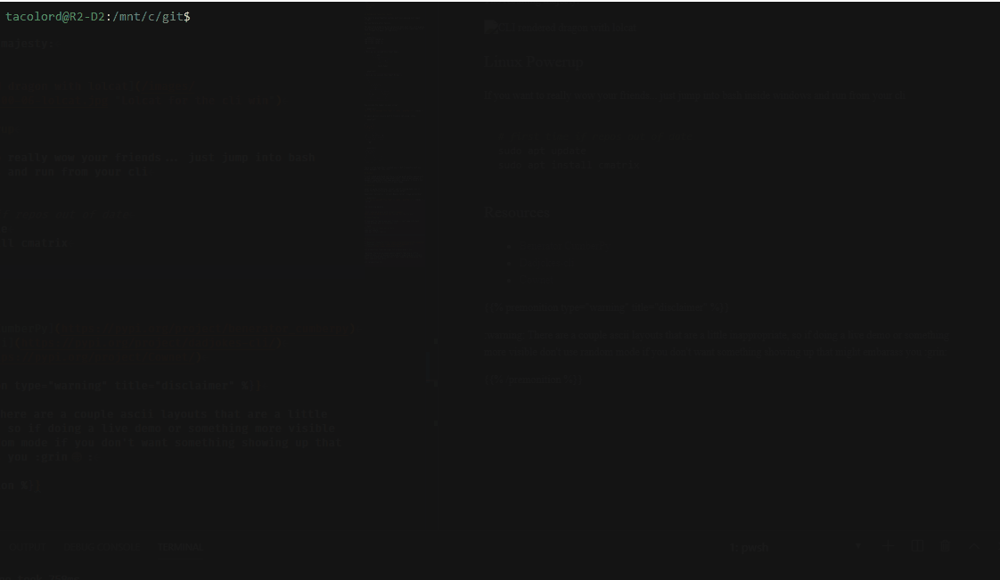

## Automation Taxes Your Sanity

You have to glue together systems with your amazing duct taped scripts.

You see failure after failure.

You want help predicting the success of your next run, so I'm going to provide you with an advanced artificially intelligent way to do this through the power of `npm install`.

## NPM

```powershell
npm install cowsay -g
npm install lucky -g
npm install catme -g
```

```powershell
 _____________________________________
< Will my run succeed this time? Hmmm >
        \    ,-^-.
         \   !oYo!
          \ /./=\.\______
               ##        )\/\
                ||-----w||
                ||      ||

               Cowth Vader
```

```powershell
 ________________________________________
< Will my run succeed this time? No way! >
 ----------------------------------------
   \
    \
     \
        __ \ / __
       /  \ | /  \
           \|/
       _.---v---.,_
      /            \  /\__/\
     /              \ \_  _/
     |__ @           |_/ /
      _/                /
      \       \__,     /
   ~~~~\~~~~~~~~~~~~~~`~~~
```

Now include the header in your script

```powershell
"Will my run succeed this time? $( lucky --eightball)" | cowsay -r
```

Or spice up your console with a friendly cat using `catme`

```powershell

 /\     /\
{  `---'  }
{  O   O  }
~~>  V  <~~
 \  \|/  /
  `-----'__
  /     \  `^\_
 {       }\ |\_\_   W
 |  \_/  |/ /  \_\_( )
  \__/  /(_E     \__/
    (  /
     MM
```

```powershell
  /\ ___ /\
 (  o   o  )
  \  >#<  /
  /       \
 /         \       ^
|           |     //
 \         /    //
  ///  ///   --
```

There's a few PowerShell related one's, but I honestly just use other packages for this this.

## Python

I just looked and found out there's a few great python equivalents so you could easily run some great stuff. They've got cowsay, a benedict cumberbatch like name generator, and more. I think I fell in love with Python a little bit more today.

## Level Up

Level it up by installing `lolcat` and if running Cmder you'll enjoy the Skittlitizing of your console output.

PowerShell version is: `Install-Module lolcat -Scope CurrentUser`

```powershell
"Will my run succeed this time? $( lucky --eightball)" | cowsay -r | lolcat
```

The resulting majesty:


## Linux Powerup

If you want to really wow your friends... just jump into bash inside windows and run from your cli. This is a level so far beyond the normal windows command line experience it might just make you uninstall windows and live purely on a Linux terminal for your remaining days.

This looks like a good background while waiting to start presentations :rocket:

```bash
# first time if repos out of date
sudo apt update
sudo apt install cmatrix
```



## Resources

* [Benerator CumberPy](https://pypi.org/project/benerator_cumberpy)
* [Dadjokes-cli](https://pypi.org/project/dadjokes-cli/)
* [Cownet](https://pypi.org/project/Cownet/)

> [!warning] disclaimer+
> :warning: There are a couple ascii layouts that are a little inappropriate, so if doing a live demo or something more visible don't use random mode if you don't want something showing up that might embarass you :grin:
